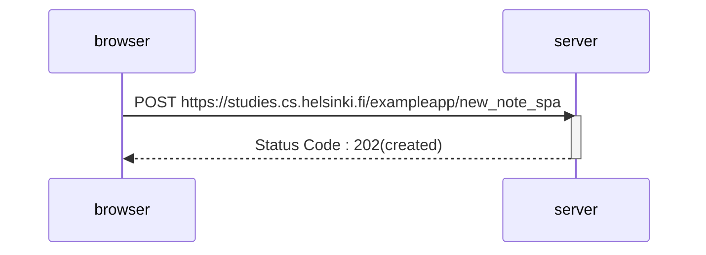

```mermaid
sequenceDiagram
    participant browser
    participant server

    browser->>server: POST https://studies.cs.helsinki.fi/exampleapp/new_note_spa
    activate server
    server-->>browser:  Status Code : 202(created)
    deactivate server

```

Note: Only one http request is sent to server while creating new note and htlm is updated using javascript no redirect in single app page 